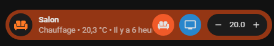
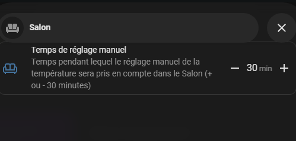
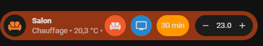

> Cette méthode vise à permettre de désactiver les automatisations liés au contrôle de vos thermostats, et donc de contrôler la température pendant une période que vous définissez.
Cela requiert 
- hacs: https://github.com/custom-components/hacs
- Bubble-Card : https://github.com/Clooos/Bubble-Card
- Numberbox-card : https://github.com/junkfix/numberbox-card

trouvable dans HACS

# Documentation

La documentation est maintenant découpée en plusieurs pages pour faciliter la lecture et la recherche d'informations :
1. [présentation](documentation/presentation.md),
3. [Création des différents éléments](documentation/creation.md),
4. [Bonus](documentation/bonus.md)

# Quelques illustrations 

Quand on change manuellement la température, apparaît la fenêtre pour choisir le temps

On peut ajouter un rappel du temps restant du contrôle manuel

